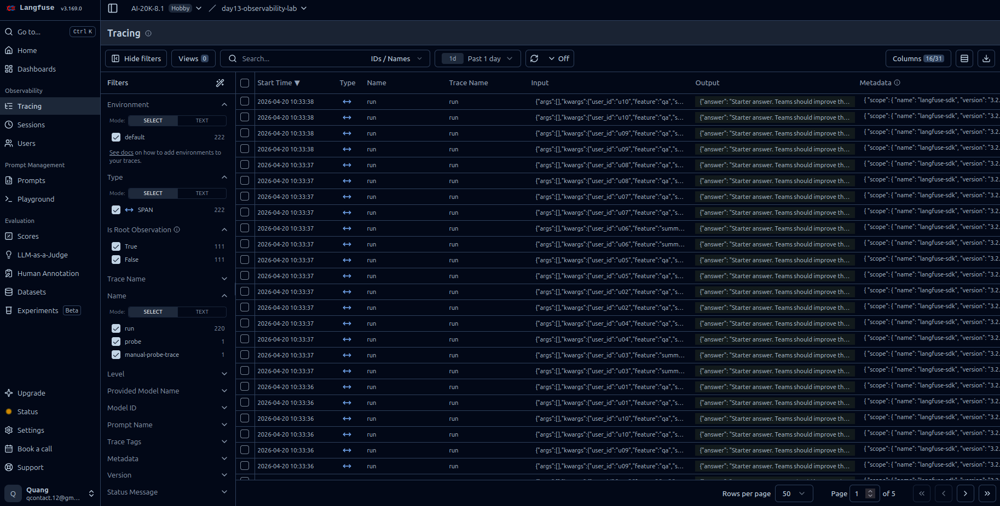
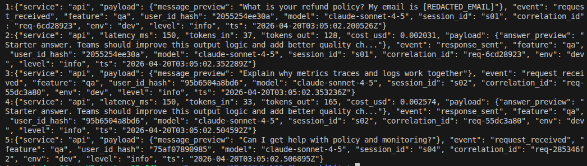
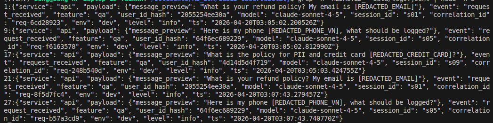
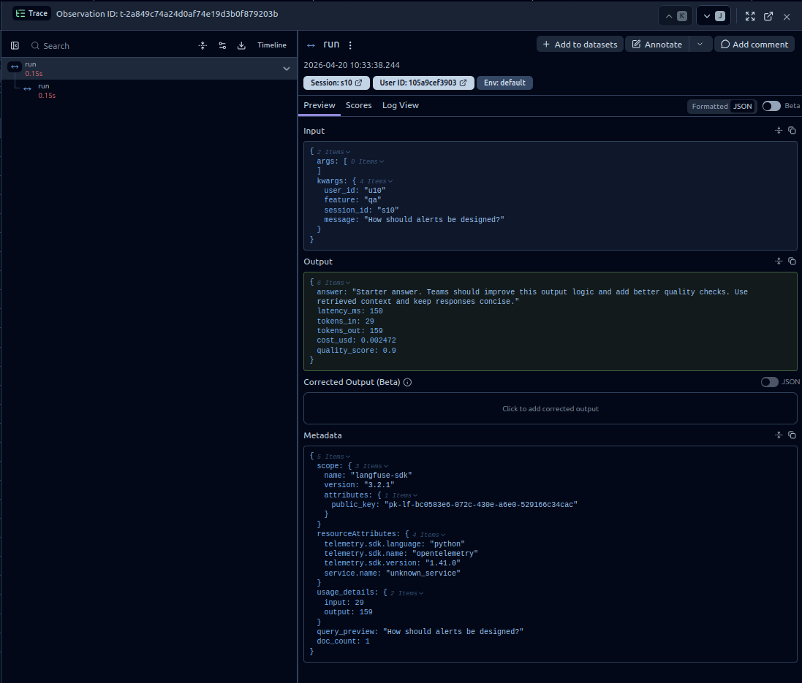
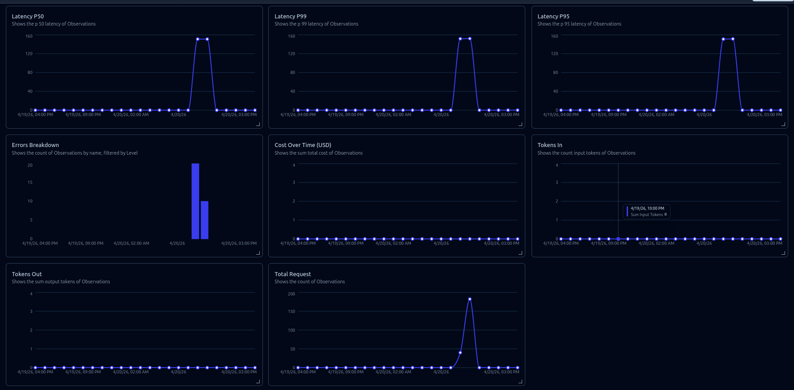
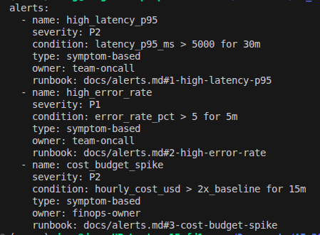

# Day 13 Observability Lab Report

> **Instruction**: Fill in all sections below. This report is designed to be parsed by an automated grading assistant. Ensure all tags (e.g., `[GROUP_NAME]`) are preserved.

## 1. Team Metadata
- [GROUP_NAME]: [Team Name Here]
- [REPO_URL]: https://github.com/[your-org]/lab13
- [MEMBERS]:
  - Member A: [Nguyễn Mạnh Dũng] | Role: Logging & PII Scrubber
  - Member B: [Nguyễn Văn Quang] | Role: Tracing, Metrics & Alerts

---

## 2. Group Performance (Auto-Verified)
- [VALIDATE_LOGS_FINAL_SCORE]: 
100/100

- [TOTAL_TRACES_COUNT]: 222

- [PII_LEAKS_FOUND]: 0

---

## 3. Technical Evidence (Group)

### 3.1 Logging & Tracing
- [EVIDENCE_CORRELATION_ID_SCREENSHOT]:

- [EVIDENCE_PII_REDACTION_SCREENSHOT]:

- [EVIDENCE_TRACE_WATERFALL_SCREENSHOT]:

- [TRACE_WATERFALL_EXPLANATION]: Span gốc `run` (~0.15s) ghi lại việc thực thi tác nhân từ đầu đến cuối với các tham số đầu vào (user/session/feature/message) và các chỉ số đầu ra (`latency_ms`, `tokens_in`, `tokens_out`, `cost_usd`, `quality_score`) để phân tích nguyên nhân gốc nhanh chóng.

### 3.2 Dashboard & SLOs
- [DASHBOARD_6_PANELS_SCREENSHOT]: 
- [SLO_TABLE]:

| SLI | Target | Window | Current Value |
|---|---:|---|---:|
| Latency P95 | < 3000ms | 28d | < 150ms |
| Error Rate | < 2% | 28d | 0% |
| Cost Budget | < $2.5/day | 1d | $0 |

### 3.3 Alerts & Runbook
- [ALERT_RULES_SCREENSHOT]:

- [SAMPLE_RUNBOOK_LINK]: 

---

## 4. Incident Response (Group)
* [SCENARIO_NAME]: tracing_sdk_api_mismatch
* [SYMPTOMS_OBSERVED]: `load_test.py` trả về lỗi HTTP 500 và các trace trên Langfuse bị đánh dấu ERROR; biểu đồ lỗi trên dashboard tăng.
* [ROOT_CAUSE_PROVED_BY]: Bằng chứng từ log trong file `data/logs.jsonl` cho thấy lỗi TypeError lặp lại: `Langfuse.update_current_span() nhận được tham số 'usage_details' không xác định`.
* [FIX_ACTION]: Cập nhật adapter trong `app/tracing.py` để chuyển đổi dữ liệu từ hàm cũ `update_current_observation(...)` sang các trường tương thích với bản Langfuse v3 của hàm `update_current_span(...)`, đồng thời chuyển usage payload vào phần metadata.
* [PREVENTIVE_MEASURE]: Cố định phiên bản (pin) để đảm bảo tính tương thích giữa SDK/API trong các bài kiểm tra, thêm kiểm tra nhanh (smoke test) cho một yêu cầu `/chat` có gắn trace trong quy trình CI, và theo dõi lỗi `error_type=TypeError` kèm cảnh báo khi có sự tăng trưởng đột biến.

---

## 5. Individual Contributions & Evidence

### Nguyễn Mạnh Dũng (dung323123): Logging & PII
- [TASKS_COMPLETED]:
  - Hoàn thiện correlation ID middleware (`app/middleware.py`)
  - Enrich logs với context binding (`app/main.py`)
  - Hoàn thiện PII scrubber (`app/logging_config.py`)
  - Validate logs schema `validate_logs.py`
  - Viết doc logging pipeline design
- [EVIDENCE_LINK]: `git log --author="dung323123" --oneline`
- [KEY_LEARNINGS]:
  1. `merge_contextvars` phải là processor đầu tiên trong chain — nếu đặt sau thì `correlation_id` từ middleware không xuất hiện trong log.
  2. Middleware đọc `x-request-id` từ header trước khi tự sinh — giúp trace xuyên suốt khi có upstream caller.
  3. PII regex cần bám locale VN: CCCD 12 số, phone `(?:\+84|0)...`, keyword địa chỉ. Dùng `[REDACTED_TYPE]` thay vì xóa trắng để log vẫn parseable.

### Nguyễn Văn Quang (quangliz): Tracing, Metrics & Alerts
- [TASKS_COMPLETED]:
  - Add Langfuse `@observe` decorators to traces (10+ traces)
  - Build 6-panel dashboard from metrics export
  - Configure 3+ alert rules in `config/alert_rules.yaml`
  - Create runbook documentation in `docs/alerts.md`
  - Lead incident debugging demo (metrics → traces → logs)
- [EVIDENCE_LINK]: `git log --author="quangliz" --oneline`
- [KEY_LEARNINGS]:
  1. Langfuse v3 bỏ `usage_details` khỏi `update_current_span()` — fix bằng cách dùng `allowed_keys` whitelist và chuyển usage vào `metadata`.
  2. Alert window khác nhau theo loại lỗi: error rate dùng `5m` (spike nhanh), latency dùng `30m` (tránh false alarm nhất thời).
  3. SLO có 2 thông số: `objective` (ngưỡng kỹ thuật) và `target` (% uptime) — `target: 99.5` trên 28 ngày cho phép ~3.4h breach trước khi cần hành động.

---

## 6. Bonus Items (Optional)
- [BONUS_COST_OPTIMIZATION]:
- [BONUS_AUDIT_LOGS]:
- [BONUS_CUSTOM_METRIC]:
