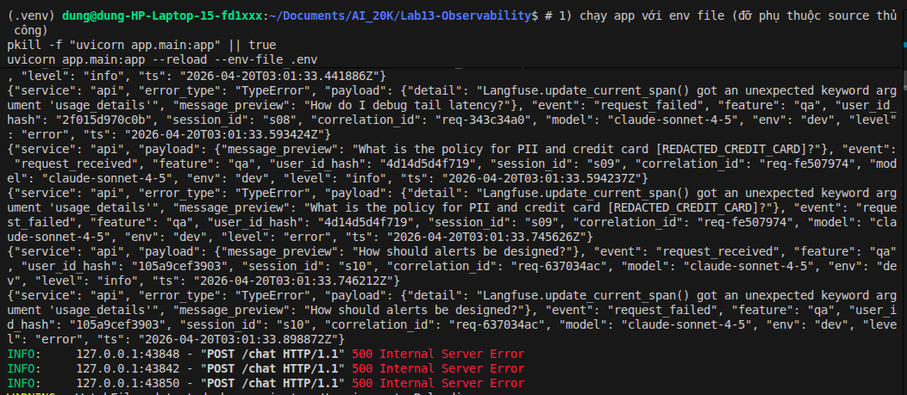
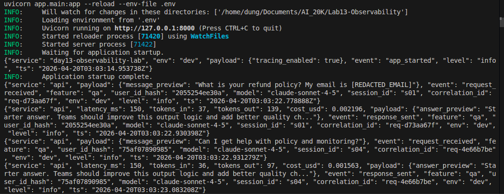
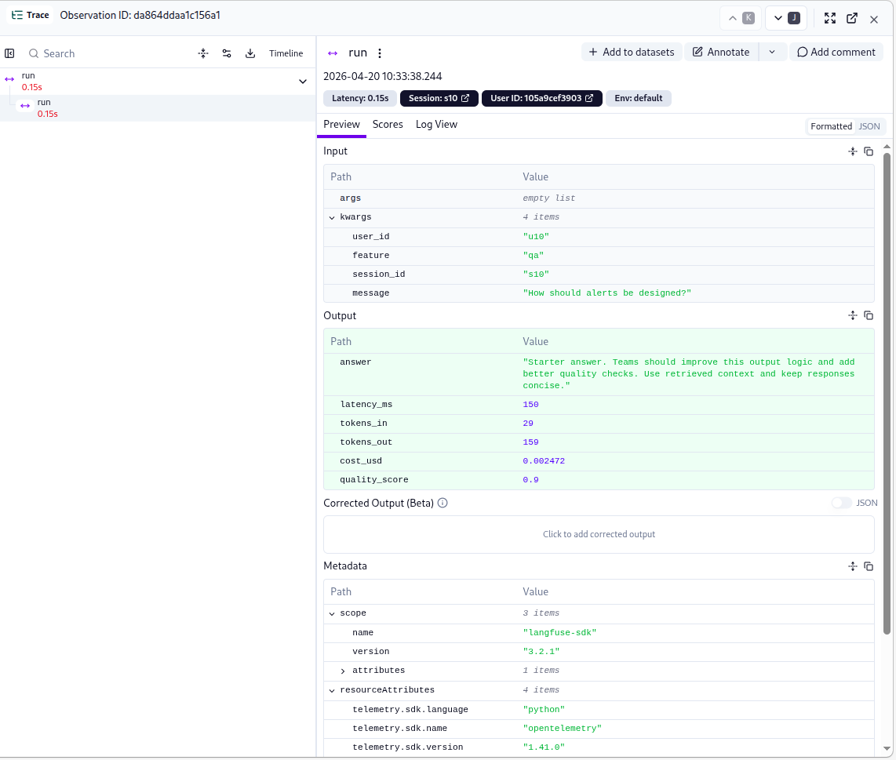

# Evidence Collection Sheet

## Required screenshots
- Langfuse trace list with >= 10 traces (`images/total_trace_count.png`)
- One full trace waterfall (`images/trace_waterfall.png`)
- JSON logs showing correlation_id (`images/correlation_id.png`)
- Log line with PII redaction (`images/REDACTED.png`)
- Dashboard with 6 panels (`images/dashboard_6_panels.png`)
- Alert rules with runbook link (`images/alert_rules.png`, runbook: `docs/alerts.md#1-high-latency-p95`)

## Optional screenshots
- Incident before/after fix

Before fix:

After fix:

- Cost comparison before/after optimization: NA
- Auto-instrumentation proof 

